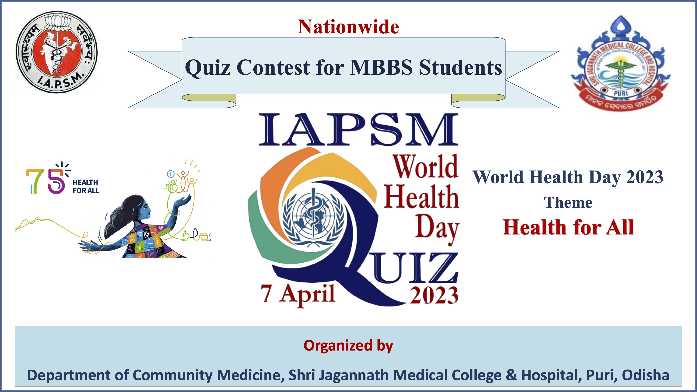

***For registration [click here](https://docs.google.com/forms/d/e/1FAIpQLSe2gMpy6jXfjHDGnVmL_Ohsm0qClTq0LQ7R18Q2QwGQQS5M3w/viewform)***

World Health Day is celebrated annually on April 7th, to mark the founding of World Health Organization (WHO) in 1948. It is a day to raise awareness about the importance of health and well-being of people around the world, and to encourage people to take action to improve their own health as well as the health of their communities.

-   Each year, WHO carves out a theme for World Health Day that highlights a particular area of concern or challenge in global health.

-   The theme for World Health Day 2022 was "Our planet, our health". This theme reflected the adverse impact of COVID-19 pandemic and the need to address health inequalities that have been exacerbated by the pandemic. global attention on urgent actions needed to keep humans and the planet healthy and foster a movement to create societies focused on well-being

-   While the COVID-19 pandemic showed us the healing power of science, it also highlighted the inequities in our world. The pandemic has revealed weaknesses in all areas of society and underlined the urgency of creating sustainable well-being societies committed to achieving equitable health now and for future generations without breaching ecological limits.

-   On 7 April 2023 (World Health Day) ̶ the World Health Organization will observe its 75th birthday. WHO's 75th anniversary year is an opportunity to look back at public health successes that have improved quality of life during the last seven decades. It is also an opportunity to motivate action to tackle the health challenges of today̶ and tomorrow.

-   The theme for this year is "Health for All"

On this occasion, the Department of Community Medicine, SJMCH, Puri in association with WHO and IAPSM is going to conduct a department level quiz competition. The details about this competition is as follows:

-   All Undergraduate students from 1st year to final year can participate in this quiz.

-   Students have to register in terms of three students in a group.

-   Questions will be based on world health day theme and topics of community medicine.

-   There will be two rounds

    -   Elimination round

    -   Final Round

-   Elimination Round will be MCQ based with negative marking and will be conducted on 3rd April 2023.

-   The Final Round will take place covering four rounds on 10th April 2023, which are: o Rotation round o Visual question round o MCQ round with no negative marking o Rapid fire round with no negative marking

So, register yourself at the earliest to participate in this exciting competition and demonstrate your acumen on the World Health Day's historic significance on the health and well-being of people across the globe.

-   For registration [click here](https://docs.google.com/forms/d/e/1FAIpQLSe2gMpy6jXfjHDGnVmL_Ohsm0qClTq0LQ7R18Q2QwGQQS5M3w/viewform)
