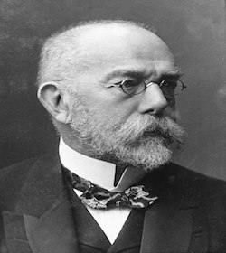

---
authors:
- Dr. Debasish Pandit
categories:
- Introduction
date: "2022-01-02"
image: 
  caption: 'Image credit: **Dr. Debasish**'
  focal_point: ""
lastMod: "2022-01-02"
projects: []
subtitle: This post let you introduce with the eminent persons in the field of public health and their contributions. 
summary: This post let you introduce with the eminent persons in the field of public health and their contributions.
tags: 
- Academic
title: Scientists and their contribution in public health
---
### BC:

**Hippocrates (460BC-375BC)**

-  An ancient Greek physician who lived during Greece’s Classical period and is traditionally regarded as the **"father of medicine"** and was the **first epidemiologist**. 
- He introduced  the term "Epidemics" & "Endemics"
and "Epidemiological Observations"

### 17th Century:

**John Graunt (1620-1674)**
- One of the first demographer and perhaps the first epidemiologist, who started record keeping and analysis of vital statistics
- He has been regarded as the **"Founder of Demography"**
- John Graunt's application of theory to data was one of the first instances of **descriptive statistics**. 

**Thomas Sydenham (1624-1689)**
- Known as the **"Father of English Medicine"** or **"English Hippocrates"**.
- Introduced the concept of Observational Study. 
- In 1679, Sydenham gave Whooping cough the name pertussis, meaning a violent cough of any type
- Classification of Fever: Continuous, Intermittent & Small pox

### 18th Century:

**Leeuwnhoek (1632-1723)**
- **Antonie Philips van Leeuwenhoek** was a Dutch businessman and scientist in the Golden Age of Dutch science and technology. 
- He is commonly known as **"the Father of Microbiology"**, and one of the first microscopist and microbiologists.
- Van Leeuwenhoek is best known for his pioneering work in microscopy and for his contributions toward the establishment of microbiology as a scientific discipline.

**James Lind (1716-1794)**
- First ever to conduct **clinical study (Experimental Study)** and established the relation between citrus fruit and scurvy. 
- He was a pioneer of naval hygiene in the Royal Navy.
- His work advanced the practice of preventive medicine and improved nutrition.

### 19th Century:

**Edward Jenner (1749-1823)**
- He was a British physician and scientist who pioneered the concept of vaccines including creating the smallpox vaccine, the **world's first** ever **vaccine.**
-  Jenner is often called the **"Father of immunology"**, and his work is said to have "saved more lives than the work of any other human"

**William Farr (1807-1883)**
- He was a British epidemiologist, regarded as one of the **"Founders of medical statistics"**.
- Introduced Statistics & develop modern statistical system
Introduce the concept of multi-factorial aetiology.

**John Snow (1813-1858)**
- He is known as the **"Father of Modern Epidemiology"** because of his work in tracing the source of a cholera outbreak in Soho, London, in 1854. 
- Snow's findings inspired people for changes in the water and waste systems of London, and a significant improvement in **general public health**around the world.
- He laid the groundwork for **Descriptive & Analytic epidemic approach** and formulate various methods of investigation of diseases

**Semmelweis (1818-1865)**
- **Ignaz Philipp Semmelweis** was a Hungarian physician and scientist, now known as an early pioneer of antiseptic procedures
- He was described as the **"saviour of mothers"**. 
- HE discovered that the incidence of puerperal fever (also known as "childbed fever") could be drastically cut by the use of hand disinfection in obstetrical clinics and hence, the importance of hand washing. 
- He introduce the concept of **Intervention & Retrospective Study**

**Louis Pasteur (1822-1859)**
- Identified Causes of many diseases(Rabies, Anthrax)
- Identification of bacteria as a cause of many diseases 
- He is regarded as one of the founders of modern bacteriology and has been honoured as the **"father of bacteriology"** and as the **"father of microbiology"** (together with Robert Koch,and the latter epithet also attributed to Antonie van Leeuwenhoek).
- Pasteur is also regarded as one of the **"Fathers of germ theory of diseases"**, which was a minor medical concept at the time.
- Discovered the vaccine against Rabies and Anthrax
- He is best known to the general public for his invention of the technique of treating milk and wine to stop bacterial contamination, a process now called pasteurization.
- Introduce the conept of cause-effect study in epidemiology. 

**Robert Koch (1843-1910)**
- Identified Causes of many diseases( Anthrax, Tuberculosis, Cholera, Infectious conjunctivitis)
- Introduced the Concept of Sterilization"
- Known as **"Father of Microbiology"**
- First to take photograph of micro-organism
- Worked in epidemics of Water-born diseases and their control(Water Filtration)"

